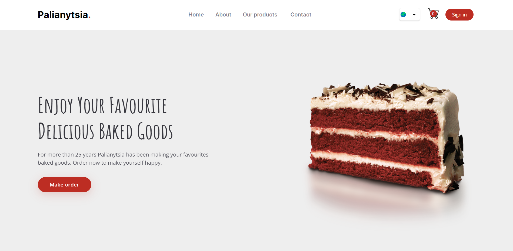
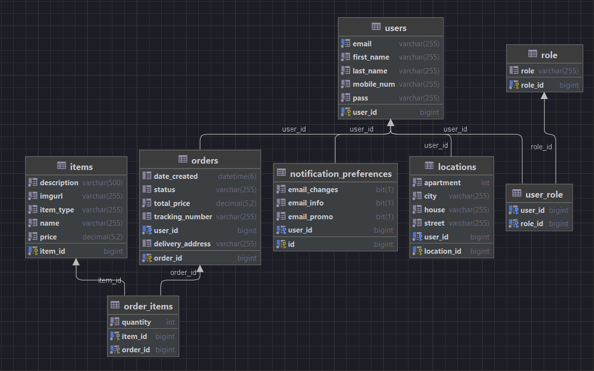

# palianytsia

This website is created for online store Palianytsia for saling pastries and baked goods. Customer registers in the system, fills account with addresses for delivery and subscribe/unsuscribe on newsletter. On the site user can choose prefered item from various options, make the order and track it.  

### Components used for the project
- Java 8
- Spring Boot
- Maven
- Git
- MySQL
- JDBC
- Log4J2
- ThymeLeaf
- Hibernate

### DB Diagram

